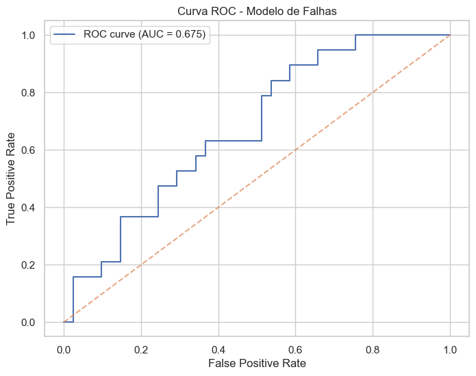
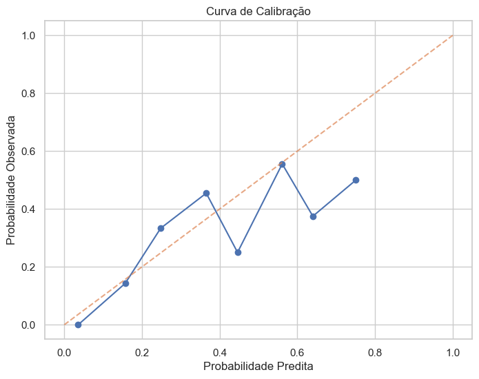
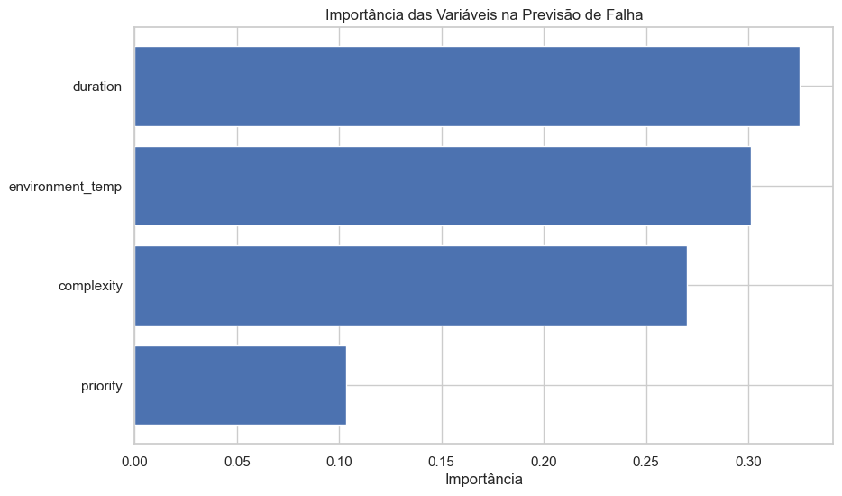
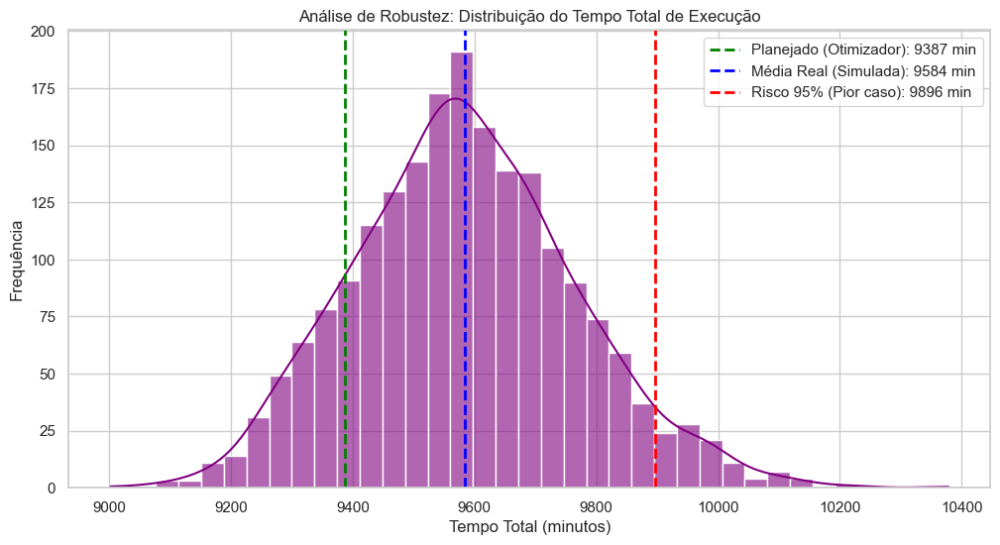
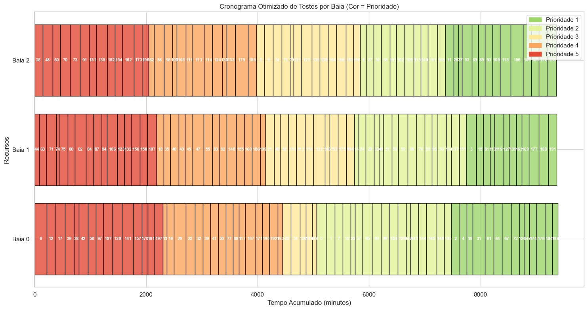
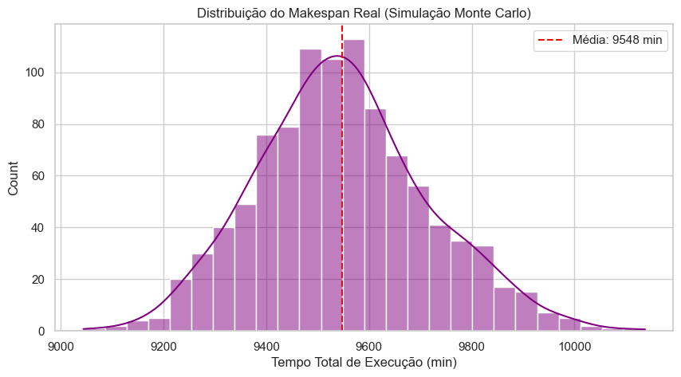

# Simulacao_Otimizacao_IA

## Sumário

Este repositório contém um estudo integrado de **predição de falhas**, **otimização de agendamento** e **simulação estocástica** aplicado ao planejamento de testes veiculares (case fictício). O objetivo principal é reduzir o *makespan* (tempo total de conclusão dos testes) em múltiplas baias, incorporando a probabilidade de falhas prevista por modelos de Machine Learning para gerar agendas mais robustas.

---

## Conteúdo principal

- `Simulacao_Otimizacao_IA.ipynb` — Notebook com todo o fluxo: geração de dados, modelagem preditiva, formulação MILP, execução do solver e simulação Monte Carlo.

---

## Estrutura

### 1. Introdução e Contexto
Apresenta a motivação do estudo: atrasos em ciclos de testes veiculares ocasionados por falhas inesperadas, necessidade de alocação eficiente de recursos e robustez operacional.

### 2. Objetivos
- Minimizar o Makespan para um conjunto de testes em múltiplas baias.
- Integrar estimativas de risco de falha (probabilidades) ao processo de agendamento.
- Avaliar robustez do cronograma via simulação de Monte Carlo.

### 3. Geração e Análise de Dados
Descreve o dataset (número de testes, features geradas sinteticamente — duração, prioridade, complexidade, temperatura — e variável alvo `failure`). Inclui distribuição estatística resumida, correlações e plots exploratórios gerados pelo notebook.

### 4. Modelo Preditivo de Falhas
- **Algoritmo**: Random Forest Classifier (configuração e validação).
- **Divisão**: treino (70%) / teste (30%).
- **Métricas**: AUC-ROC, Brier Score, matriz de confusão, calibração probabilística.
- **Importância de variáveis**: ranking das features e interpretação.

### 5. Modelo de Otimização (Agendamento Sensível ao Risco)
- **Formulação**: MILP para minimizar Makespan com variáveis de alocação binárias.
- **Estratégia risk-aware**: duração esperada ajustada = duração nominal + p(falha) × tempo_de_reparo.
- **Restrições**: cada teste alocado a exatamente uma baia, capacidade das baias, prioridades, janelas temporais (se aplicável).
- **Solver utilizado**: (ex.: CBC, Gurobi, CPLEX — especificar no notebook).

### 6. Simulação Numérica — Monte Carlo
- **Número de iterações**: (ex.: 2.000)
- **Cenários**: variabilidade natural da duração (ruído gaussiano proporcional) e eventos de falha Bernoulli com p estimado.
- **Métricas de interesse**: tempo médio real, P95, distribuição do makespan real, taxa de retrabalho.

### 7. Resultados e Análises
Resumo dos principais resultados: makespan planejado vs. médio simulado, P95, distribuição de carga entre baias e efeito da estratégia sensível ao risco. Incluir gráficos de Gantt e histogramas (salvos em `results/`).

### 8. Conclusões e Recomendações
Síntese das lições aprendidas, limitações (ex.: dados sintéticos, simplificações do modelo), e próximos passos (ex.: validação com dados reais, incorporação de janelas temporais, otimização multiobjetivo).

---

# Análise Técnica Detalhada (Código e Gráficos)

# Case Fictício – Simulação, Otimização e IA 
## Planejamento de Testes Veiculares

Este notebook demonstra:
1. Geração de dados sintéticos  
2. Modelo preditivo de falhas (Machine Learning)  
3. Simulação Monte Carlo  
4. Otimização de agendamento de testes (PuLP)  

> **Observação:** Todos os dados são fictícios e usados apenas para fins demonstrativos.


```python
import numpy as np
import pandas as pd
import matplotlib.pyplot as plt
import seaborn as sns
import pulp
import random

from sklearn.model_selection import train_test_split
from sklearn.ensemble import RandomForestClassifier
from sklearn.metrics import roc_auc_score, brier_score_loss, roc_curve, confusion_matrix

sns.set(style="whitegrid")
plt.rcParams['figure.figsize'] = (10, 6)
```

## Geração de dados sintéticos


```python

np.random.seed(42)

n_tests = 200

df_tests = pd.DataFrame({
    'test_id': range(n_tests),
    'duration': np.random.normal(120, 30, n_tests).clip(30),
    'priority': np.random.randint(1, 6, n_tests),
    'complexity': np.random.randint(1, 4, n_tests),
    'environment_temp': np.random.normal(25, 5, n_tests)
})


raw = 0.25 * df_tests['complexity'] + 0.05 * (df_tests['duration']/60) + 0.03 * abs(df_tests['environment_temp'] - 25)
df_tests['true_prob'] = (raw - raw.min()) / (raw.max() - raw.min()) * 0.8  # escala entre 0 e 0.8
df_tests['failure'] = np.random.binomial(1, df_tests['true_prob'])


df_tests.head()

```


<div>
<style scoped>
    .dataframe tbody tr th:only-of-type {
        vertical-align: middle;
    }

    .dataframe tbody tr th {
        vertical-align: top;
    }

    .dataframe thead th {
        text-align: right;
    }
</style>
<table border="1" class="dataframe">
  <thead>
    <tr style="text-align: right;">
      <th></th>
      <th>test_id</th>
      <th>duration</th>
      <th>priority</th>
      <th>complexity</th>
      <th>environment_temp</th>
      <th>true_prob</th>
      <th>failure</th>
    </tr>
  </thead>
  <tbody>
    <tr>
      <th>0</th>
      <td>0</td>
      <td>134.901425</td>
      <td>2</td>
      <td>1</td>
      <td>7.609154</td>
      <td>0.491076</td>
      <td>1</td>
    </tr>
    <tr>
      <th>1</th>
      <td>1</td>
      <td>115.852071</td>
      <td>2</td>
      <td>3</td>
      <td>23.658685</td>
      <td>0.493363</td>
      <td>1</td>
    </tr>
    <tr>
      <th>2</th>
      <td>2</td>
      <td>139.430656</td>
      <td>1</td>
      <td>1</td>
      <td>22.410439</td>
      <td>0.109567</td>
      <td>0</td>
    </tr>
    <tr>
      <th>3</th>
      <td>3</td>
      <td>165.690896</td>
      <td>1</td>
      <td>1</td>
      <td>29.464127</td>
      <td>0.177262</td>
      <td>0</td>
    </tr>
    <tr>
      <th>4</th>
      <td>4</td>
      <td>112.975399</td>
      <td>1</td>
      <td>3</td>
      <td>22.183707</td>
      <td>0.529630</td>
      <td>0</td>
    </tr>
  </tbody>
</table>
</div>


## Modelo preditivo de falhas


```python

features = ['duration', 'priority', 'complexity', 'environment_temp']
X = df_tests[features]
y = df_tests['failure']

X_train, X_test, y_train, y_test = train_test_split(
    X, y, test_size=0.3, random_state=42
)

model = RandomForestClassifier(
    n_estimators=200,
    max_depth=6,
    random_state=42
)

model.fit(X_train, y_train)

probs = model.predict_proba(X_test)[:, 1]

auc = roc_auc_score(y_test, probs)
brier = brier_score_loss(y_test, probs)

auc, brier

```


    (0.6752246469833119, 0.20667400618779375)


```python

#  Curva ROC e Avaliação (AUC, Brier)
from sklearn.metrics import roc_curve, auc, brier_score_loss
fpr, tpr, thresholds = roc_curve(y_test, probs)
roc_auc = auc(fpr, tpr)
brier = brier_score_loss(y_test, probs)

plt.figure(figsize=(8,6))
plt.plot(fpr, tpr, label=f'ROC curve (AUC = {roc_auc:.3f})')
plt.plot([0,1], [0,1], linestyle='--', alpha=0.7)
plt.xlabel('False Positive Rate')
plt.ylabel('True Positive Rate')
plt.title('Curva ROC - Modelo de Falhas')
plt.legend()
plt.show()

print(f'AUC: {roc_auc:.4f}')
print(f'Brier score: {brier:.4f}')

# Curva de calibração 
from sklearn.calibration import calibration_curve
prob_true, prob_pred = calibration_curve(y_test, probs, n_bins=10)

plt.figure(figsize=(8,6))
plt.plot(prob_pred, prob_true, marker='o')
plt.plot([0,1],[0,1], linestyle='--', alpha=0.7)
plt.xlabel('Probabilidade Predita')
plt.ylabel('Probabilidade Observada')
plt.title('Curva de Calibração')
plt.show()

```


    

    


    AUC: 0.6752
    Brier score: 0.2067
    


    

    


**Interpretação:**  
- AUC indica capacidade de discriminar testes com maior risco de falha.  
- Brier score avalia a calibração das probabilidades previstas.


# Visualização da Performance do Modelo


```python
#  Feature Importance
importances = pd.DataFrame({
    'feature': features,
    'importance': model.feature_importances_
}).sort_values('importance', ascending=False)

importances = importances.sort_values('importance')

plt.barh(importances['feature'], importances['importance'])
plt.xlabel('Importância')
plt.title('Importância das Variáveis na Previsão de Falha')
plt.show()

```


    

    


# Preparação para Otimização


```python
# Aplicar o modelo em TODO o dataset para o cenário de otimização
df_tests['prob_failure'] = model.predict_proba(df_tests[features])[:, 1]

# Definir um tempo de reparo médio 
REPAIR_TIME = 60

# Calcular Duração Esperada = Duração Teste + (Prob. Falha * Tempo Reparo)
# Isso penaliza testes arriscados, fazendo o otimizador alocá-los com mais inteligência
df_tests['expected_duration'] = df_tests['duration'] + (df_tests['prob_failure'] * REPAIR_TIME)

print("Exemplo de ajuste de risco:")
print(df_tests[['test_id', 'duration', 'prob_failure', 'expected_duration']].head())
```

    Exemplo de ajuste de risco:
       test_id    duration  prob_failure  expected_duration
    0        0  134.901425      0.623079         172.286153
    1        1  115.852071      0.651148         154.920935
    2        2  139.430656      0.080813         144.279441
    3        3  165.690896      0.187161         176.920575
    4        4  112.975399      0.349787         133.962636
    

##  Problema de otimização (agendamento simplificado)


Objetivo:
- Minimizar o tempo total ponderado pela prioridade e risco de falha.

Restrições:
- Apenas uma baia de teste
- Testes executados sequencialmente


```python
#  Otimização com Múltiplas Baias ---

def optimize_multi_bay(df, n_bays=3):
    # Problema: Minimizar o Makespan (o tempo da baia que termina por último)
    prob = pulp.LpProblem("Multi_Bay_Scheduling", pulp.LpMinimize)
    
    # Variáveis de decisão: x[i][j] = 1 se o teste i for alocado na baia j
    tests = df.index.tolist()
    bays = range(n_bays)
    
    x = pulp.LpVariable.dicts("assign", (tests, bays), cat='Binary')
    
    # Variável auxiliar para o Makespan (Cmax)
    Cmax = pulp.LpVariable("Makespan", lowBound=0)
    
    # Função Objetivo: Minimizar o Makespan
    prob += Cmax
    
    # Restrição 1: Cada teste deve ser alocado a exatamente uma baia
    for i in tests:
        prob += pulp.lpSum([x[i][j] for j in bays]) == 1
        
    # Restrição 2: O tempo total de cada baia não pode exceder Cmax
    # Usamos a 'expected_duration' que criamos com a IA
    for j in bays:
        prob += pulp.lpSum([x[i][j] * df.loc[i, 'expected_duration'] for i in tests]) <= Cmax
        
    

    # Resolver
    prob.solve(pulp.PULP_CBC_CMD(msg=1, timeLimit=60, gapRel=0.05))
    
    # Recuperar resultados
    results = []
    for i in tests:
        for j in bays:
            if pulp.value(x[i][j]) > 0.5:
                results.append({
                    'test_id': df.loc[i, 'test_id'],
                    'bay': j,
                    'duration_actual': df.loc[i, 'duration'],
                    'duration_risk': df.loc[i, 'expected_duration'],
                    'priority': df.loc[i, 'priority']
                })
                
    return pd.DataFrame(results), pulp.value(Cmax)

# Executar a otimização
df_scheduled, final_makespan = optimize_multi_bay(df_tests, n_bays=3)

print(f"Makespan Otimizado (Tempo total estimado): {final_makespan:.2f} minutos")
df_scheduled.head()
```

    Makespan Otimizado (Tempo total estimado): 9386.62 minutos
    


<div>
<style scoped>
    .dataframe tbody tr th:only-of-type {
        vertical-align: middle;
    }

    .dataframe tbody tr th {
        vertical-align: top;
    }

    .dataframe thead th {
        text-align: right;
    }
</style>
<table border="1" class="dataframe">
  <thead>
    <tr style="text-align: right;">
      <th></th>
      <th>test_id</th>
      <th>bay</th>
      <th>duration_actual</th>
      <th>duration_risk</th>
      <th>priority</th>
    </tr>
  </thead>
  <tbody>
    <tr>
      <th>0</th>
      <td>0</td>
      <td>0</td>
      <td>134.901425</td>
      <td>172.286153</td>
      <td>2</td>
    </tr>
    <tr>
      <th>1</th>
      <td>1</td>
      <td>0</td>
      <td>115.852071</td>
      <td>154.920935</td>
      <td>2</td>
    </tr>
    <tr>
      <th>2</th>
      <td>2</td>
      <td>0</td>
      <td>139.430656</td>
      <td>144.279441</td>
      <td>1</td>
    </tr>
    <tr>
      <th>3</th>
      <td>3</td>
      <td>1</td>
      <td>165.690896</td>
      <td>176.920575</td>
      <td>1</td>
    </tr>
    <tr>
      <th>4</th>
      <td>4</td>
      <td>0</td>
      <td>112.975399</td>
      <td>133.962636</td>
      <td>1</td>
    </tr>
  </tbody>
</table>
</div>


##  Simulação Monte Carlo de durações


```python
# Validação via Simulação de Monte Carlo 

def validate_schedule_robustness(schedule_df, n_simulations=1000, repair_time=60):
    """
    Simula a execução do cronograma definido milhares de vezes para
    avaliar o risco de atrasos reais.
    """
    makespans = []
    
    # Agrupa quais testes estão em qual baia (conforme decidido pelo otimizador)
    bays_allocation = schedule_df.groupby('bay')['test_id'].apply(list).to_dict()
    
    # Aqui usamos os dados originais para simular a 'Realidade'
    original_data = df_tests.set_index('test_id')
    
    print(f"Iniciando {n_simulations} simulações de Monte Carlo...")
    
    for _ in range(n_simulations):
        bay_completion_times = []
        
        # Para cada baia, calculamos quanto tempo ela realmente levou nessa simulação
        for bay, tests in bays_allocation.items():
            bay_total_time = 0
            
            for tid in tests:
                # 1. Incerteza Natural: A duração varia um pouco (Desvio Padrão de 15%)
                base_duration = np.random.normal(
                    original_data.loc[tid, 'duration'], 
                    original_data.loc[tid, 'duration'] * 0.15
                )
                base_duration = max(20, base_duration) # Garante que não seja negativo/muito curto
                
                # 2. Evento de Falha: Joga-se a moeda com base na probabilidade prevista
                # Se falhar, adiciona o tempo de reparo
                prob_failure = original_data.loc[tid, 'prob_failure']
                failure_event = np.random.binomial(1, prob_failure)
                
                actual_duration = base_duration + (failure_event * repair_time)
                bay_total_time += actual_duration
            
            bay_completion_times.append(bay_total_time)
        
        # O tempo total do projeto (Makespan) é determinado pela baia que terminar por último
        makespans.append(max(bay_completion_times))
        
    return makespans

# Executar a validação
# 'df_scheduled' é o DataFrame que saiu da etapa de Otimização (Pulp)
simulated_makespans = validate_schedule_robustness(df_scheduled, n_simulations=2000)

# --- Visualização dos Resultados da Simulação ---
plt.figure(figsize=(12, 6))
sns.histplot(simulated_makespans, kde=True, color='purple', alpha=0.6)


mean_time = np.mean(simulated_makespans)
p95_time = np.percentile(simulated_makespans, 95)
planned_time = final_makespan # O valor que o otimizador prometeu

plt.axvline(planned_time, color='green', linestyle='--', linewidth=2, label=f'Planejado (Otimizador): {planned_time:.0f} min')
plt.axvline(mean_time, color='blue', linestyle='--', linewidth=2, label=f'Média Real (Simulada): {mean_time:.0f} min')
plt.axvline(p95_time, color='red', linestyle='--', linewidth=2, label=f'Risco 95% (Pior caso): {p95_time:.0f} min')

plt.title('Análise de Robustez: Distribuição do Tempo Total de Execução')
plt.xlabel('Tempo Total (minutos)')
plt.ylabel('Frequência')
plt.legend()
plt.show()

print(f"Conclusão da Simulação:")
print(f"O otimizador estimou {planned_time:.0f} min.")
print(f"Na prática (média), levará {mean_time:.0f} min.")
print(f"Existe 5% de chance de ultrapassar {p95_time:.0f} min.")
```

    Iniciando 2000 simulações de Monte Carlo...
    


    

    


    Conclusão da Simulação:
    O otimizador estimou 9387 min.
    Na prática (média), levará 9584 min.
    Existe 5% de chance de ultrapassar 9896 min.
    

# Visualização do Agendamento (Gantt)


```python
#  Gráfico de Gantt

def plot_gantt(df_sched):
    # Ordenar por baia e prioridade
    df_sched = df_sched.sort_values(by=['bay', 'priority'], ascending=[True, False])
    
    fig, ax = plt.subplots(figsize=(15, 8))
    
    # Paleta de 6 cores (índices 0 a 5). 
    # Como prioridade vai de 1 a 5, usaremos os índices 1 a 5.
    colors = sns.color_palette("RdYlGn_r", 6) 
    
    for bay in df_sched['bay'].unique():
        bay_data = df_sched[df_sched['bay'] == bay]
        current_time = 0
        
        for _, row in bay_data.iterrows():
            
            priority_idx = int(row['priority'])
            
            ax.barh(
                y=f"Baia {bay}", 
                width=row['duration_risk'], 
                left=current_time, 
                color=colors[priority_idx], 
                edgecolor='black',
                alpha=0.8
            )
            
            
            if row['duration_risk'] > 20:
                ax.text(
                    current_time + row['duration_risk']/2, 
                    bay, 
                    str(int(row['test_id'])), 
                    ha='center', va='center', color='white', fontsize=8, weight='bold'
                )
            
            current_time += row['duration_risk']
            
    plt.title('Cronograma Otimizado de Testes por Baia (Cor = Prioridade)')
    plt.xlabel('Tempo Acumulado (minutos)')
    plt.ylabel('Recursos')
    
    
    patches = [plt.Rectangle((0,0),1,1, color=colors[i]) for i in range(1, 6)]
    plt.legend(patches, [f'Prioridade {i}' for i in range(1, 6)], loc='upper right')
    
    plt.tight_layout()
    plt.show()

plot_gantt(df_scheduled)
```


    

    


# Simulação Final (Robustez)


```python
# Validação via Monte Carlo 

def simulate_schedule_execution(schedule_df, n_simulations=1000):
    makespans = []
    
    # Agrupar testes por baia conforme definido pelo otimizador
    bays_allocation = schedule_df.groupby('bay')['test_id'].apply(list).to_dict()
    
    
    original_data = df_tests.set_index('test_id')
    
    for _ in range(n_simulations):
        bay_times = []
        
        for bay, tests in bays_allocation.items():
            total_time = 0
            for tid in tests:
                # 1. Variabilidade natural da duração (Normal)
                base_duration = np.random.normal(
                    original_data.loc[tid, 'duration'], 
                    original_data.loc[tid, 'duration'] * 0.1
                )
                
                # 2. Ocorrência de Falha (Binomial baseada na prob real oculta ou do modelo)
                # Vamos usar a prob do modelo para ser justo com o planejador
                is_fail = np.random.binomial(1, original_data.loc[tid, 'prob_failure'])
                
                actual_duration = base_duration + (is_fail * 60) 
                total_time += actual_duration
            
            bay_times.append(total_time)
        
        # O makespan da simulação é a baia que demorou mais
        makespans.append(max(bay_times))
        
    return makespans

sim_results = simulate_schedule_execution(df_scheduled)

plt.figure(figsize=(10, 5))
sns.histplot(sim_results, kde=True, color='purple')
plt.axvline(np.mean(sim_results), color='red', linestyle='--', label=f'Média: {np.mean(sim_results):.0f} min')
plt.title('Distribuição do Makespan Real (Simulação Monte Carlo)')
plt.xlabel('Tempo Total de Execução (min)')
plt.legend()
plt.show()
```


    

    


